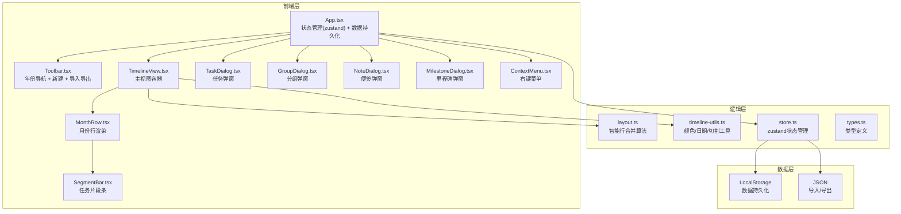
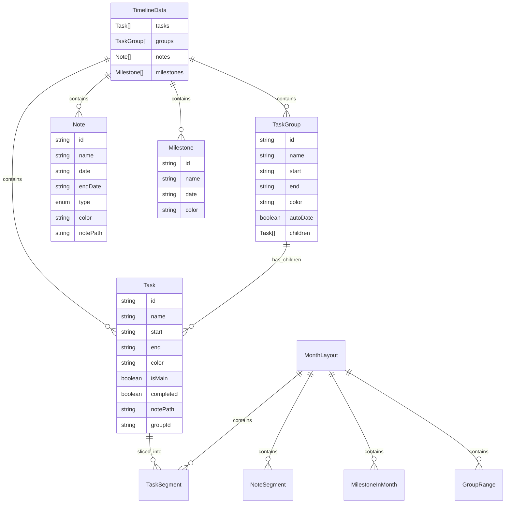

## 1. 架构设计



## 2. 技术说明

- **前端框架**：React 18 + TypeScript（函数组件 + Hooks）
- **构建工具**：Vite
- **样式方案**：原生 CSS 文件（保持莫兰迪色系设计规范）
- **日期库**：dayjs
- **状态管理**：zustand（轻量全局状态管理）
- **数据持久化**：LocalStorage + JSON 导入/导出
- **图标**：lucide-react
- **零依赖 Obsidian API**：完全独立运行

## 3. 路由定义

| 路由 | 用途 |
|------|------|
| / | 单页应用，时间轴视图（无需路由库） |

本项目为单页应用，无需 React Router。

## 4. 数据模型

### 4.1 数据模型定义



### 4.2 LocalStorage 数据格式

```json
{
  "tasks": [
    {
      "id": "uuid-string",
      "name": "政治第一轮",
      "start": "2024-09-01",
      "end": "2024-10-31",
      "color": "#A8C4D9",
      "isMain": false,
      "completed": false,
      "notePath": "",
      "groupId": ""
    }
  ],
  "groups": [
    {
      "id": "uuid-string",
      "name": "分组名称",
      "start": "2024-01-01",
      "end": "2024-06-30",
      "color": "#10B981",
      "autoDate": true,
      "children": []
    }
  ],
  "notes": [
    {
      "id": "uuid-string",
      "name": "重要事件",
      "date": "2024-02-14",
      "type": "pin",
      "color": "#F59E0B"
    }
  ],
  "milestones": [
    {
      "id": "uuid-string",
      "name": "里程碑节点",
      "date": "2024-04-01",
      "color": "#FBBF24"
    }
  ]
}
```

## 5. 文件结构

```
src/
├── components/
│   ├── Toolbar.tsx          # 工具栏：年份导航 + 新建 + 导入导出
│   ├── TimelineView.tsx     # 主视图：布局计算 + 月份行列表
│   ├── MonthRow.tsx         # 月份行：标签 + 日历网格 + 任务/便签/里程碑
│   ├── SegmentBar.tsx       # 任务片段条：渐变/圆角/箭头/主线/完成
│   ├── TaskDialog.tsx       # 任务弹窗：新建/编辑/删除
│   ├── GroupDialog.tsx      # 分组弹窗：新建/编辑/删除
│   ├── NoteDialog.tsx       # 便签弹窗：新建/编辑/删除
│   ├── MilestoneDialog.tsx  # 里程碑弹窗：新建/编辑/删除
│   └── ContextMenu.tsx      # 右键菜单：编辑/删除/标记完成
├── utils/
│   ├── layout.ts            # 智能行合并算法（支持主线任务优先）
│   └── timeline-utils.ts    # 颜色/日期/切割/便签/里程碑工具函数
├── store/
│   └── index.ts             # zustand 全局状态管理
├── types/
│   └── index.ts             # 类型定义
├── styles/
│   └── timeline.css         # 完整样式（莫兰迪色系 + 新增实体样式）
├── main.tsx                 # 入口
└── App.tsx                  # 应用根
```

## 6. 关键算法说明

### 6.1 智能行合并 (calculateLayout)

- 主线任务(isMain=true)优先分配第0行
- 其余任务按开始日期升序排序后贪心放置
- 时间复杂度：O(n * r)，n 为任务数，r 为行数
- 空间复杂度：O(n)
- 稳定性：按开始日期排序保证确定性输出

### 6.2 跨月切割 (sliceTasksForYear)

- 遍历每个任务，按月份边界切割
- 标记 isStart/isEnd 控制圆角和箭头
- 每个月份独立计算 totalRows
- 同样处理便签和分组范围

### 6.3 颜色分配

- 默认：`parseInt(taskId.slice(0, 1), 16) % 10` 选取莫兰迪色
- 主线任务：强制使用 #EF4444 红色
- 自定义：用户在弹窗中选择预设色或输入 hex 值

### 6.4 分组日期自动计算

- 当 autoDate=true 时，遍历 children 计算最早开始日期和最晚结束日期
- 分组范围覆盖所有子任务的时间跨度
