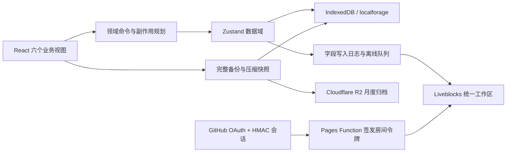
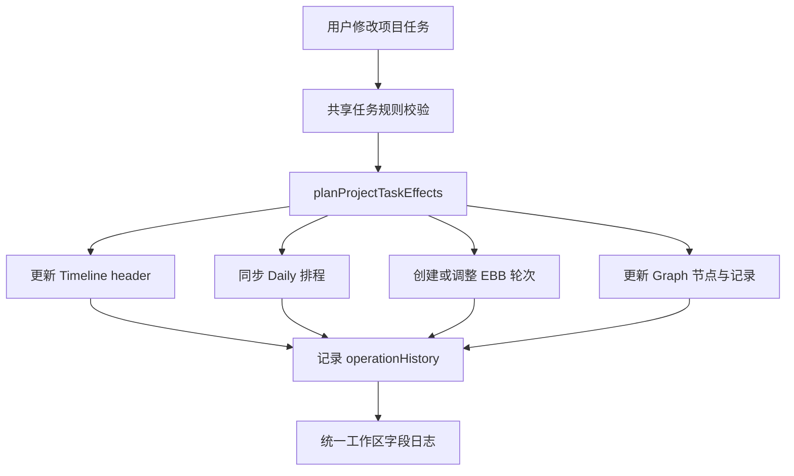

# SmartLine 架构与数据说明

## 1. 总体架构

SmartLine 是本地优先单页应用。React 负责视图，Zustand 管理五个数据域，IndexedDB 保存主数据；Liveblocks 是可选实时同步层，Cloudflare Pages Functions 提供认证、令牌和归档 API。



## 2. 技术栈

| 层次 | 技术 |
| --- | --- |
| UI | React 18、TypeScript、Framer Motion、Lucide |
| 构建 | Vite 6、PostCSS、gzip/Brotli 产物 |
| 状态 | Zustand 5、Liveblocks Zustand middleware |
| 本地存储 | localforage / IndexedDB；localStorage 保存设置、租约和紧急日志 |
| 日期与布局 | Day.js、本地日期函数、D3 层级/缩放/绘制 |
| 拖拽 | `@hello-pangea/dnd` |
| 安全渲染 | DOMPurify、CSP 与响应安全头 |
| 服务端 | Cloudflare Pages Functions、GitHub OAuth、Liveblocks REST、R2 |
| 测试 | Node test runner、系统模拟、Playwright |

## 3. 数据域

### 3.1 Timeline 域

字段包括 `tasks`、`groups`、`notes`、`milestones`、`lifeStages`。`Task` 同时代表年度项目和项目文档容器，`blocks` 是当前项目内容载体：文本块保存纯文本，智能任务块保存结构化 header 与富文本 body。

分组中的 `children` 是任务副本；`reconcileTimelineTaskCopies` 按 ID 维持顶层任务与分组副本一致，业务读取通过 `getUniqueTasks` 去重。

Timeline store 的 header 更新先运行任务规则校验，再规划知识节点、EBB 和每日排程副作用，提交各 store 更新，最后登记可撤销操作。

### 3.2 Daily 域

`schedules` 以 `YYYY-MM-DD` 为键，每日包含 `items`（时段有序事项）和 `blocks`（带起止时间的时间块）；`retrospectives` 单独按日期保存。

项目任务和复习任务不会复制完整业务对象，只保留稳定 `sourceId` 及显示快照。读取时从 Timeline/EBB 域解析源对象，避免用名称关联。

### 3.3 EBB 域

字段包括 `reviewTasks`、`inboxItems`、`outlineNodes`、`ebbSettings`。复习链身份优先使用 `graphNodeId`，旧数据回退为主题名。`roundOrder` 是稳定轮次身份，到期日改变不改变轮次。

复习调度步骤：

1. 解析复杂度或自定义间隔；
2. 计算 `dueDate = startDate + interval`；
3. 同主题同日冲突时向后移动；
4. 智能分散在最大窗口内检查任务数、积分负载和主题间隔；
5. 完成时验证所有前序轮次；
6. 按轮次和复杂度计算积分与预计时长。

### 3.4 Graph 域

知识节点保存父级、状态、归档、学习记录和显示信息。归一化删除悬空父级、自父级和循环关系。激活状态采用后序递归：叶节点读取自身状态，父节点由所有可见直接子节点状态派生。

绑定由独立 binding store 和领域函数处理。项目任务完成时，系统根据绑定数量、复习状态和用户选择决定是否激活节点、创建复习链或只完成项目任务。

### 3.5 Life Map 域与项目投影

人生地图的长期系统、关键日期、时期重点、文字便签、人生时期、二级分类和复盘仍由独立 Life Map 域保存；项目则以 Timeline `Task` 为唯一数据源，通过 `planningAreaId` 和纯投影模块进入人生地图。项目条、智能任务节点、项目规划筛选和项目文档编辑共享同一个任务 ID，不复制项目数据。历史 `LifeGoal kind: 'plan' | 'phase'` 只为旧数据的读取和编辑兼容保留，新建项目统一进入 Timeline。

`LifeArea.planGroupId` 把用户可编辑的二级分类映射到固定 learning/work/life 一级分类，`lifeMapPlanGroups` 保存三组的同步上下位置偏好。一级顺序固定，二级按组内 `order` 排序，可删空任一组；删除 tombstone 会阻止默认分类在规范化、同步或恢复后重生。`planSwimlaneLayout.ts` 是纯布局边界：每个二级分类先为长期系统分配轨道，再为包含结束日的项目做最少轨道分配，子阶段继承父项目；输出上下占用高度供画布计算动态 `axisY`。

工作区 schema 7 为项目增加可选 `planningAreaId`。统一工作区按实体属性合并项目正文与分类，并拒绝更高版本客户端；旧模块房间没有 schema 协商，因此一旦存在分类数据就禁止连接或回退，要求先迁移到统一工作区。

持续系统按有效日期范围统计。维护期从目标天数中扣除；周以周一开始，跨月目标按有效天数比例向上取整。

## 4. 跨域业务事务



撤销记录保存修改前 patch、预期修改后值和相关 Daily 快照。执行撤销时先比较当前值；若用户已在之后修改字段，撤销失败并提示冲突，避免覆盖新数据。

## 5. 日期、布局与顺延

业务日期统一使用 `YYYY-MM-DD`。`dateSafe.ts` 提供本地午夜构造、加减天、比较和差值，避免把无时区日期误按 UTC 解析。

年度时间轴先生成时间戳，再以区间着色思路分配行：主线任务优先布局，普通任务按开始日和结束日排序，放入第一个不重叠行；随后按月切片生成任务段、便签段、里程碑和分组边界。

整项目顺延使用“纯规划 + 命令提交”：纯函数生成新项目与新 schedules，命令层一次提交并登记撤销。时间块冲突时转为时段项，保证来源任务不丢失。

## 6. 持久化

每个 store 先从 IndexedDB hydrate，再允许 UI 进入完整工作区。写入有防抖、重试和状态标记。localStorage 仅承担同步设置、设备 ID、revision、跨标签页租约、少量 UI 偏好和 IndexedDB 不可用时的紧急日志。

启动时恢复 store、迁移旧数据、启动 revision 追踪、跨标签页广播和同步重连。Service Worker 延迟注册，不缓存 API、认证或 Liveblocks 请求。

## 7. 统一工作区同步

当前 schema 为 `6`。统一房间 ID 形如 `workspace-{identity}-{roomCode}`，五个 store 进入同一 room 并映射到不同 storage 字段。schema 5 引入固定项目大类；schema 6 支持全局关键日期及项目—目标、关键日期—项目可选关系。

- **首次连接保护**：比较远端与本地完整内容 hash 和摘要；双方非空且不同则拒绝连接。
- **版本门禁**：远端 schema 高于本地支持版本时拒绝连接。
- **写入日志**：本地字段变化都保存变化值和 base 值，不依赖 Liveblocks 是否 ready。
- **离线队列**：队列保存在 IndexedDB，并有 localStorage 紧急副本；重连后由主标签页刷新。
- **三方合并**：base/local/remote 逐字段合并；带 `id` 的实体数组继续按实体和属性递归合并。
- **冲突副本**：无法安全合并的字段保存成可恢复副本，不静默覆盖。
- **跨标签页协调**：BroadcastChannel 同步字段，localStorage 租约选出队列主写者。

旧架构使用 Timeline、EBB、Daily、Graph、Life Map 五个房间。迁移读取所有旧房间、生成完整备份并比较摘要和 SHA-256；验证一致后才切换统一房间，且不删除源房间。

## 8. 备份、快照和归档

完整备份顶层结构如下：

```text
kind: smart-line-workspace
schemaVersion: 6
revision / exportedAt / deviceId
timeline / lifeMap / ebb / graph / daily / settings
```

导入验证顶层类型、唯一 ID、日期/时间、跨引用和各域结构，恢复前创建本地快照。快照拆成 header、timeline、lifeMap、ebb、graph、daily、settings 七段；支持 `CompressionStream` 时使用 gzip，相同内容块按 hash 复用，并按保留策略清理。

R2 归档以 GitHub 用户 ID 和 `YYYY-MM` 生成对象键。PUT 最大 10 MiB，使用 ETag 与 `If-Match`/`If-None-Match` 防止多设备覆盖。未绑定 R2 时 API 返回 503，不影响本地和 Liveblocks 功能。

## 9. 认证与安全边界

- OAuth 使用随机 state、PKCE S256 和 10 分钟临时 cookie；
- 只有 `ALLOWED_GITHUB_LOGIN` 可创建会话；
- 会话由至少 32 字符密钥做 HMAC-SHA256 签名；
- cookie 为 HttpOnly、Secure、SameSite=Lax，有效期 30 天；
- 修改型 Pages API 检查同源 Origin；
- Liveblocks token 只授予请求房间写权限；
- 统一房间必须匹配当前 GitHub ID 或历史 login 前缀；
- R2 对象按 GitHub 用户 ID 隔离。

静态响应头包括 CSP、`nosniff`、禁止 frame、严格 referrer 和 Permissions Policy。富文本通过 DOMPurify 净化：禁止布局样式、类名/ID、表单、SVG/MathML、嵌入对象和 data URI 图片，外部图片只允许 HTTPS；安全扫描会防止高风险白名单被意外重新放开。

## 10. 加载与性能

主应用同步加载壳层，六个主视图、同步弹窗和表格导入均动态 import。Rollup 把 React、Liveblocks、D3、Day.js、Motion、Zustand、DOMPurify 和图标库拆为独立 chunk，并生成 gzip/Brotli 文件。

SheetJS chunk 较大，但仅在表格导入路径加载。各主视图由 Suspense 和 Error Boundary 包裹，模块加载或渲染失败显示局部恢复界面。

人生地图的滚动热路径使用 CSS sticky 保持 128px 分类栏、项目内部标签和人生时期标题，不再在 rAF 中遍历胶囊写入 transform。小地图关闭时滚动过程对画布不产生逐帧样式写入；开启时只更新小地图窗口。父子索引、分类范围和统计在 React 渲染前通过 `Map` 线性聚合，水平虚拟化保留稳定 overscan。

## 11. 兼容与迁移原则

- load/import 先归一化旧字段；Markdown 待办仅作一次性迁移来源，当前载体是 blocks。
- 旧 `graphNodeId` 与新 `graphNodeIds` 同时读取，写入逐步转向数组。
- 旧复习轮次缺少 `roundOrder` 时确定性补齐。
- Life Map schema 迁移保持旧字段可读，写入使用独立 store。
- 高版本工作区不允许旧客户端降级写入。
